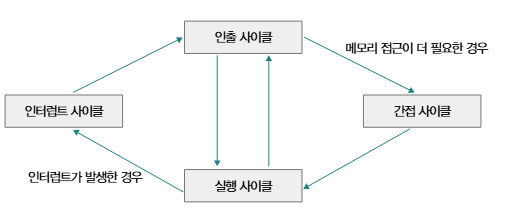
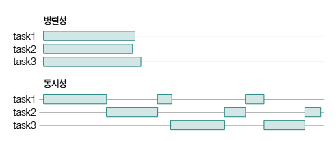
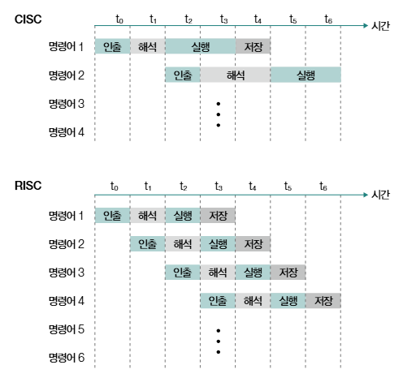

### 1. 레지스터
> CPU 내 작은 임시 저장 장치

메모리에 저장된 정보를 읽고, 쓰고, 실행하는 역할을 합니다.
CPU 내 여러 레지스터가 존재하고 각기 다른 이름과 역할을 합니다.

레지스터의 역할 종류
- 프로그램 카운터
- 명령어 레지스터
- 범용 레지스터
- flag 레지스터
- 스택포인터

**1. 프로그램 카운터 PC (명령어 포인터)**

메모리에서 다음으로 읽어들인 주소를 저장하는 레지스터
PC 값은 1씩 증가하므로 메모리에 저장된 프로그램이 순차 실행이 가능합니다.

**2. 명령어 레지스터**

메모리에서 방금 읽어들인 명령어를 저장하는 레지스터
명령어 해석 후 ALU에 연산을 시킵니다.

**3. 범용 레지스터**

Data, 명령어, 주소를 모두 저장 가능한 레지스터
CPU 안에는 여러 레지스터가 있고, 자유롭게 사용하는 레지스터입니다.

**4. flag 레지스터**

연산 결과, CPU 상태에 대한 부가 정보인 flag 값을 저장하는 레지스터

명령어 처리 시 반드기 참조할 상태의 정보를 의미합니다.

flag 레지스터 종류

1. **부호 플래그** : 연산 결과 부호 (양수 : 0, 음수 : 1)
2. **제로 플래그** : 연산 결과가 0인지 (연산결과 0 : 제로플래그 1, 연산결과 1 : 제로플래그 0)
3. **캐리 플래스** : 반올림, 빌림수가 발생했는지 (발생 시 캐리 플러그 : 1)
4. **오버플로우 플래그** : (오버플로우 발생 시 : 1)
5. **인터럽트 플래그** : (인터럽트가 가능한 경우 : 1, 불가능한 경우 : 0)
6. **슈퍼바이저 플래그** : (커널모드로 실행 중이면 : 1, 사용자 모드 실행 중 : 0)

**5. 스택포인터**

*Stack 영역 : Stack 처럼 사용할 메모리 영역
메모리 내 스택 영역 최상단 스택 데이터의 위치를 가리키는 레지스터

### 2. 인터럽트 
> CPU 작업을 방해하는 신호

- 동기 인터럽트 : CPU가 오류나 예외를 마주쳤을 때 CPU에 의해 방생하는 인터럽트
- 비동기 인터럽트 (하드웨어 인터럽트) : 입출력 장치에 의해 발생하는 인터럽트, 효율적인 명령어 처리를 위해 사용합니다.

하드웨어 인터럽트 처리 순서
1. 입출력 장치가 CPU에 **인터럽트 요청 신호 보냄**
2. CPU는 **인터럽트 여부를 확인** (CPU는 실행 사이클 끝나고 명령어 인출 전 인터럽트 여부를 항상 확인한다)
3. CPU는 인터럽트 플래그를 통해 **현재 인터럽트를 받아들일 수 있는지 여부를 확인**
4. CPU는 지금까지 **작업을 백업 (메모리 내 스택에)**
5. CPU는 인터럽트 벡터를 참조해 **인터럽트 서비스 루틴을 실행**
   
   *인터럽트 서비스 루틴의 시작 주소가 위치한 곳으로 PC(프로그램 카운터)값을 갱신하고 인터럽트 서비스 루틴 실행
7. 인터럽트 서비스 루틴 실행 후 백업했던 **작업 복구 후 실행 재개**

***인터럽트 서비스 루틴(인터럽트 핸들러)** : 인터럽트 처리 프로그램

***인터럽트 벡터** : 인터럽트 서비스 루틴을 식별하기 위한 정보 , 인터럽트 서비스 루틴의 시작 주소를 포함

```mermaid
graph TD
    A[인터럽트] --> B[동기 인터럽트 - 예외]
    A --> C[비동기 인터럽트]
    C --> D[막을 수 있는 인터럽트]
    C --> E[막을 수 없는 인터럽트]
```
>CPU가 인터럽트를 처리하는 것
> 
>   = 인터럽트 서비스 루틴을 실행하고, 본래 수행하던 작업으로 다시 돌아온다는 것

```mermaid
graph TD
    A[인터럽트] --> B[동기 인터럽트 - 예외]
    A --> C[비동기 인터럽트]
    B --> D[폴트]
    B --> E[트랩]
    B --> F[중단]
    B --> G[SW 인터럽트]
```
- **폴트** : 예외처리 직후, 예외 발생 명령어부터 실행 재개 (ex. page fault, 현재 메모리에 부재)
- **트랩** : 예외처리 직후, 예외가 발생한 명령어의 다음 명령어부터 실행을 재개하는 예외 (ex. 디버깅 브레이크 포인트)
- **중단** : 프로그램 강제 중단할 만큼의 심각한 오류 발견 시 발생 예외
- **소프트웨어 인터럽트** : 시스템 콜이 발생했을 때 발생 예외

### 3. CPU 성능 향상을 위한 설계

1. CPU 클럭 속도
> 클럭 : 컴퓨터의 부품을 일사불란하게 움직일 수 있게 하는 시간의 단위
> 
> 클럭 속도 : Hz 단위, 클럭이 1초에 몇번 반복되는가

클럭 속도는 CPU 속도이기도 합니다.
발열 문제로 클럭 속도만 높여 CPU 성능을 높이기엔 한계가 있습니다.

2. 멀티코어와 멀티스레드
> 코어 : CPU 내에서 명령어를 읽고, 해석하고 실행하는 부품

> 하드웨어 스레드 (논리 프로세서) : 하나의 코어가 동시에 처리하는 명령어의 단위
> 
> *멀티스레드 CPU : 1개의 코어로 여러 명령어를 동시에 처리하는 CPU

> 소프트웨어 스레드 : 하나의 프로그램에서 독립적으로 실행되는 단위

*하드웨어 스레드가 하나인 CPU로 프로그램 실행 시 '여러 스레드를 통해 실행이 가능하다'는 말에서 스레드는 소프트웨어적 스레드를 의미한다

> 병렬성 : 작업을 물리적으로 동시에 처리하는 성질

하드웨어 스레드가 4개인 CPU가 4개 명령어 동시 실행하는 것입니다.

> 동시성 : 동시에 작업을 처리하는 것처럼 보이는 성질

CPU가 빠르게 작업을 번갈아 처리하면 동시에 처리하는 것처럼 보입니다.

### 4. 파이프라이닝을 통한 명령어 병렬 처리

>명령어 병렬 처리 기법 : 여러 명령어 동시에 처리해 CPU를 쉬지도 않고 작동 시켜 CPU 성능을 높이기

**명령어 파이프 라이닝**

명령어 병렬 처리 기법 중 하나입니다.

1. 명령어 인출 (Instruction Fetch)
2. 명령어 해석 (Instruction Decode)
3. 명령어 실행 (Execute Instruction)
4. 결과 저장 (Write Back)

위의 단계가 겹치지 않으면, 각각 단계를 동시 실행 가능합니다.

명령어 병렬 처리에 유리한 명령어가 있고, 그렇지 않은 명령어가 있습니다.

- **CISC**(Complex Instruction Set Computer)

    복잡한 명령으로 구성된 명령어 집합
    적은 수의 명령어로 프로그램 실행 가능

- **RISC**(Reduced Instruction Set Computer)
    짧고 규격화된 명령어 (1클럭 내외로 실행되는)
    CISC보다 많은 명령어가 필요하다
    그러나 실행 주기가 짧어 파이프라이닝에 최적화되어 있다

**파이프라이닝이 성능 향상에 실패하는 경우**
- **데이터 위험** : 명령어 간 데이터 의존성 발생해 동시 처리 불가능
- **제어 위험** : 프로그램 카운터의 갑작스러운 변화로 미리 인출 중이거나 해석 중인 명령어는 쓸모가 없음
- **구조적 위험** : 명령어들을 겹쳐 실행하는 과정에서 서로 다른 명령어가 동시에 컴퓨터 부품(ALU, 레지스터 등) 사용하려고 할 때